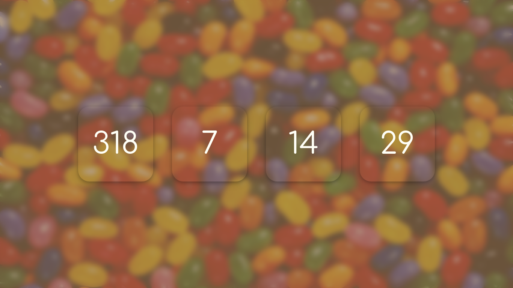

# local_countdown

It is a countdown website that you can host locally, made with Javascript. This project actually is in the version 4, for versioning probably it would need to be in version 4.3, because I already used it in the past, and changed the layout almost every time. I wanted to take the concept of eye candy to a next level in it. :)
## Disclaimer
Feel free to change things like the image or the color, the code is really simple. I do not plan to change much the layout in the future. I like it being simple.
I actually use it with the Denton font and recommend using it, but I can not really redistribute this font here.
